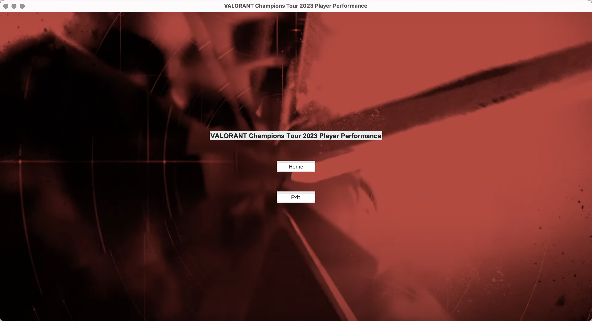
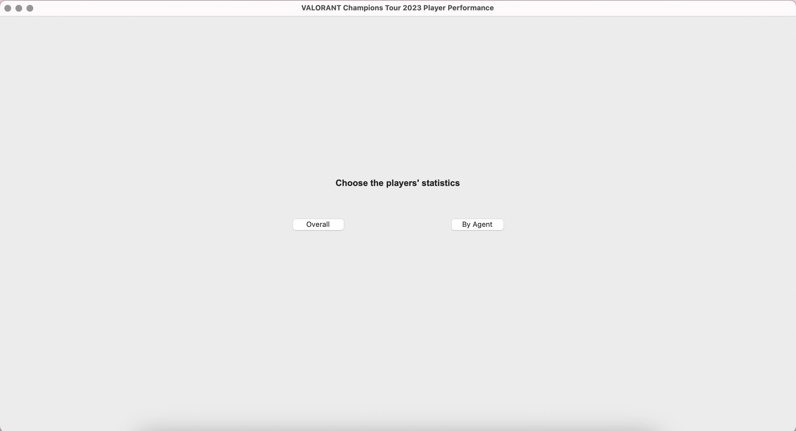
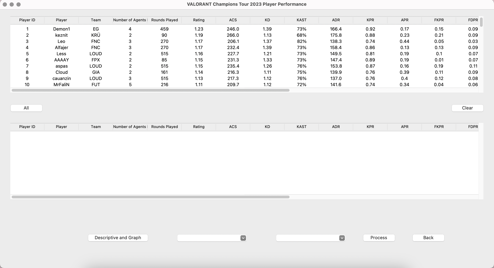
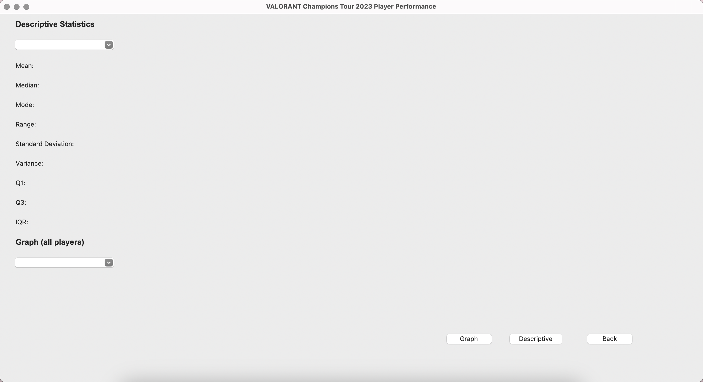
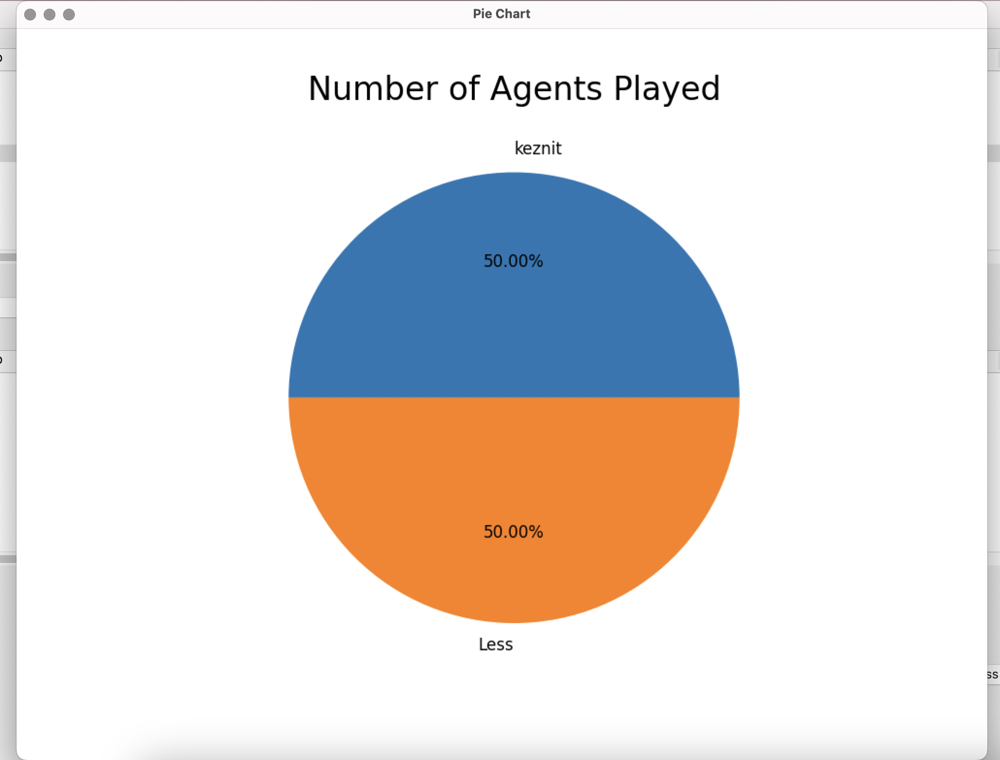

# VALORANT Champions Tour 2023 Player Performance
VALORANT is a free-to-play first-person 5v5 character-based tactical FPS tactical hero shooter developed and published by Riot Games. This project is a comprehensive tool for analyzing VALORANT player performance in the VALORANT Champions Tour 2023 (VCT2023). It allows users to analyze player statistics and match performance to gain a deeper understanding of the player's strengths, weaknesses, and contributions to their team's success.

## Data Sources
https://www.kaggle.com/datasets/vkay616/valorant-vct-2023-player-performance

(I edited the data in column CL (clutch won/lost), which the owner of this dataset wrote by using "/". This caused Excel to interpret it as a date. So, I edited it to be normal text and changed "/" to ":")

## Python Version
Requires Python >= 3.10

## Main Features
- Player Statistics: Details of player statistics, such as in-game name, unique agents used, agent types, rating, average combat score, kill/death ratio, kills per round, average damage dealt per round, etc.
- Comparison Tools: Allows users to compare players’ performance (bar chart, pie chart, scatter plot, histogram, and box plot).

## Application UI
### First Page
- This page is like a welcome page. It contains the title of the application, home button (to the second page), and exit button.

### Second Page
- This page will show 2 buttons that you need to select which one you want to see the statistics.
- "Overall" button and "By Agent" button will lead to the third page.

### Third Page
- This page will show the statistics of the player.
- This page will let you choose the player and column you want to see the graph.

### Fourth Page
- This page will show descriptive statistics of the column you choose and the graph.

### Fifth Page
- This page will show the graph that user choose.


## How to run the application
1. Clone the repository
```bash
git clone https://github.com/nicharr-nn/ValorantVCT2023.git
```
2. Create a virtual environment by running the following command in the terminal:
```bash
python -m venv venv
```
3. Activate the virtual environment by running the following command in the terminal:

MacOS or Linux:
```bash
source venv/bin/activate
```

Windows:
```bash
venv\Scripts\activate
```
4. Install the required packages by running the following command in the terminal:
```bash
pip install -r requirements.txt
```
5. Run the application by executing the following command:
```bash
python main.py
```